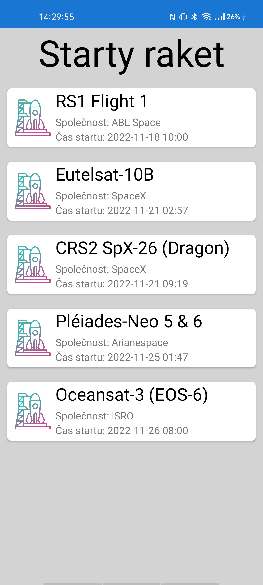

# Lift off

## Table of contents
* [About](#general-info)
* [Technologies](#technologies)
* [Setup](#setup)

## About
Lift off app is showing next 5 rocket launches with mission name, company name and time of launch. Using [Rocket launch API](https://www.rocketlaunch.live/api)

  

## Technologies
- Xamarin

## Setup
Open in Visual Studio 2019, install Android phone and start it in Visual Studio.
